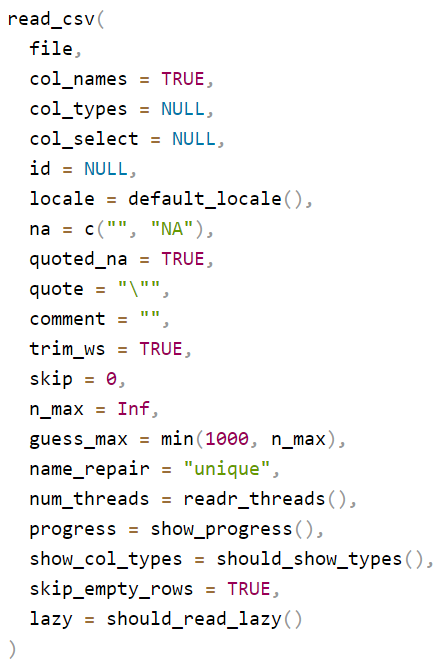

# R Packages and Libraries {#sec-packages-libraries}

```{r setup}
#| include: false
#| eval: true
```

::: {.callout-note}
## Already know this?
If you already know how to install and load R packages with `install.packages()` and `library()`, skip ahead to the next session or go straight to **Part 2: Describing and Visualizing Data**.
:::

## When Do You Use This? {.callout-tip}

> Every statistical method in R lives inside a package. Before you can run a t-test, build a regression model, or draw a plot, you need to know how to find, install, and load the right package. This session gives you that skill once — and you will use it in every session that follows.

## Learning Objectives

After completing this session you will be able to:

- Explain what an R package is and where packages come from
- Install packages from CRAN, Bioconductor, and GitHub
- Load packages into an R session and troubleshoot common errors
- Identify the key packages used throughout this course

## Understanding R Packages and Libraries

When working with R, you'll often hear about "packages" and "libraries."
It's important to understand what these are and how they are used in the
R programming environment.

### What Are R Packages?

Think of a package as a toolbox that contains a set of tools
(functions), materials (data sets), and an instruction manual
(documentation). Just as you might have different toolboxes for
different types of work (like electrical work or carpentry), in R, you
have different packages for different types of tasks, like creating
graphs, analyzing statistical data, or manipulating text.

Packages in R are created by the community: people like you and me who
need a set of functions and decide to bundle them together for everyone
to use. Once a package is created, it can be shared with others.

### What Are R Libraries?

Now, if packages are like toolboxes, then libraries are like the shelves
where you store these toolboxes. In R, a library is a directory on your
computer where packages are stored. When you install a package, it's
like putting a toolbox on one of these shelves. And when you want to use
a package, you have to take it off the shelf and open it, which in R,
you do by "loading" the package.

### Where Are Libraries Stored?

On your computer, the R libraries are stored in a place that R knows and
can access when you ask it to. This is usually a folder named "R" in
your system's library folder or in a location that you specify. You
don't usually have to worry about where this is unless you're managing
multiple versions of R or you have special security settings on your
computer.

::: callout-tip
If you want to check where the libraries are installed on computer run
this command in your console `.libPaths()`
:::

## Installing, Loading, and Managing R Packages

### What Are the Sources of R Packages?

Packages can come from several places:

## Further reading

- CRAN and package resources: @CRAN; @R-Core-Team-2023.
- Package recipes and guidance: @Matloff-2011.

1.  **CRAN (Comprehensive R Archive Network):** This is the main
    repository where R packages are stored. Think of it as the official
    app store for R. When you use install.packages(), you're usually
    downloading from CRAN.

2.  **Bioconductor:** This is a repository that's focused on
    bioinformatics packages.

3.  **GitHub:** Some developers choose to put their packages on GitHub,
    a platform for developers to share code. These aren't always
    officially released on CRAN, but you can still install them using
    tools like devtools. This requires first install devtools from
    `CRAN website`, load its libraries before using it install packages
    from Github

4.  **Local Files:** Sometimes, you might have a package file (with a
    .tar.gz extension for Mac/Linux or .zip for Windows) on your
    computer that you can install directly.

**Summary**

-   A package is a collection of functions, data, and documentation that
    extends R's capabilities.
-   A library is a place on your computer where R packages are stored.
-   You can get packages from places like CRAN, Bioconductor, GitHub, or
    even local files on your computer.
-   Once you get the hold of installing and loading packages, you'll
    have access to a vast world of tools that can help you do almost
    anything you can imagine with R.

### Section: Installing and Loading R Packages

In this section, we'll cover the essential skills of installing and
loading packages in R, a crucial step in leveraging the vast array of
tools available for data analysis in R. R packages are collections of
functions, data, and compiled code that extend the basic functionality
of R.

By the end of this section, students will be able to: 1. Install R
packages from CRAN and other repositories. 2. Load packages into an R
session. 3. Troubleshoot common issues related to package installation.

### Installing R Packages from CRAN

**Accessing CRAN** - CRAN (Comprehensive R Archive Network) is the main
repository for R packages. - To install a package from CRAN, use the
`install.packages()` function in R.

**Example Command** - For example, to install the package `ggplot2`, you
would use the command: `install.packages("ggplot2")`.

**Internet Connection** - Ensure you have an active internet connection,
as R will need to download the package files.

**Dependencies** - When installing a package, R automatically installs
any other packages (dependencies) that are required.

::: callout-note
If you use the command `install.packages("ggdag package")`, to install a
package of your choice `ggdag` as an example, and you get the following
error message.

Warning in install.packages : package 'ggdag package' is not available
for this version of R

A version of this package for your version of R might be available
elsewhere, see the ideas at
`https://cran.r-project.org/doc/manuals/r-patched/R-admin.html#Installing-packages`

You will get this error message because the package is not available on
CRAN repositiory. Search it on web and see where this package is
available and then try the below two methods You can try installing it
from GitHub using the `devtools` package or from Bioconductor.
:::

### Installing Packages from GitHub

\***Using DevTools** - The `devtools` package in R is designed to
facilitate package development and installation from sources like
GitHub. - First, install `devtools` from CRAN using
`install.packages("devtools")`. - Then load the package using
`library(devtools)`.

**Install from GitHub** - With `devtools` installed, and loaded you can
use the `install_github()` function to install packages directly from
GitHub. - The syntax is
`devtools::install_github("username/repository")`, where `username` is
the GitHub username and `repository` is the name of the repository.

**Example Command** - For instance, if you want to install a package
named `leaflet` from a GitHub user
``` rstudio``, use: ```devtools::install_github("rstudio/leaflet")\`.

**Note on Private Repositories** - For private repositories, you may
need to configure additional authentication settings.

### Installing Packages from Bioconductor

**Bioconductor for Bioinformatics** - Bioconductor is a project
providing tools for the analysis and comprehension of high-throughput
genomic data in R. - It has its own set of packages, particularly
focused on bioinformatics.

**Install Bioconductor Packages** - To install packages from
Bioconductor, first install the `BiocManager` package from CRAN using
`install.packages("BiocManager")`. - Then, use `BiocManager::install()`
to install packages from Bioconductor.

**Example Command** - For example, to install the `GenomicFeatures`
package from Bioconductor, use:
`BiocManager::install("GenomicFeatures")`.

**Bioconductor Versioning** - Bioconductor releases are semi-annual and
tied to specific versions of R. Ensure that your version of R is
compatible with the version of Bioconductor you are using.

### Loading Packages into R Session

**Using `library()`** - Once a package is installed, load it into your R
session using the `library()` function. - For example, to load
`ggplot2`, use: `library(ggplot2)`.

**Checking Installed Packages** - Use `installed.packages()` to get a
list of all packages installed in your R environment.

### Troubleshooting Package Installation

**Error Messages** - Pay close attention to any error messages during
installation; they often provide clues about the issue.

**Dependency Issues** - If there are missing dependencies, try
installing those packages separately.

**Compatibility with R Version** - Some packages may not be compatible
with your current version of R. Check the package documentation for
version requirements.

**Internet Connection and Firewalls** - Ensure a stable internet
connection. Firewalls or network policies may sometimes block R from
accessing external servers.

::: callout-tip
**Additional Resources** — Type the following commands into your R console and hit enter. This will open the R documentation window in the Help tab.

- `?install.packages` — documentation for the install function
- `?library` — documentation for loading packages
:::

## Exercise 7

This exercise is designed to familiarize you with the process of
installing and loading R packages, and exploring their functions. You'll
get hands-on experience with some of the basic data analysis packages in
R.

1.  **Install Package**:
    -   Install the following popular R packages for data analysis:
        -   `ggplot2` for data visualization.
        -   `readr` for reading rectangular data.
    -   Install your chosen package using the command
        `install.packages("packageName")`, replacing `"packageName"`
        with the name of the package.
    -   We will use these two packages in next two sections
2.  **Load the Package**:
    -   Load the package into your R session using
        `library(packageName)`.
3.  **Explore Package Functions**:

-   Using RStudio's Help Tab:

In RStudio, locate the Help tab, which is typically found in the lower
right panel in the File pane. Type the name of the package or a specific
function from the package in the search bar. Press enter, and a new page
will open, displaying detailed information about the package or
function.

::: {.callout-tip collapse="true" title="Exercise 7: Click to see solution"}
1.  **Install**

Install one by one

`install.packages("ggplot2")`

`install.packages("readr")`

OR install in one go

`install.packages("ggplot2", "readr")`

When you run the above codes you will see the following text (or
something similar) in your console It may take sometime if it is also
installing the dependencies (other packages required for ggplot2)

`trying URL 'https://cran.rstudio.com/bin/windows/contrib/3.6/ggplot2_3.2.1.zip`
`Content type 'application/zip' length 3976166 bytes (3.8 MB)`
`downloaded 3.8 MB`

`package ‘ggplot2’ successfully unpacked and MD5 sums checked`

`The downloaded binary packages are in` `C:\Users\...\your\directory`

If you see this message it means that the package is installed
successfully. Do not be afraid of the text in red color that mostly
symbolize the Error or Warning message.

2.  **Load the packages**

Use the library() function to load the packages ggplot2 and readr as
shown below

`library(ggplot2)`

`library(readr)`

When you run these commands, they should execute without any errors or
warning messages, and typically, you won't see any output in the
console. If the packages are loaded successfully, R proceeds silently,
indicating that everything is functioning correctly.

3.  **Explore**

Using RStudio's Help Tab

1.  **Locating the Help Tab**:
    -   In RStudio, find the Help tab in the lower right panel,
        typically under the File pane.
2.  **Searching for Package or Function Documentation**:
    -   In the search bar, type `ggplot2` and press enter. A new
        documentation page opens, showing detailed information about the
        `ggplot2` package. It has its own webpage and GitHub page; please
        click on the ggplot2 website [ggplot2 website](https://ggplot2.tidyverse.org) to explore more
        about ggplot usage.

    -   In the search bar, type `ggplot`, which is a function in the
        `ggplot2`, package and press enter. A new documentation page
        opens with Description, Usage, Arguments, Details and Examples
        on information page.

    -   In the search bar, type `readr` and press enter. You will see
        again a page open up with links to web pages. You can click on
        the readr website [readr website](https://readr.tidyverse.org) to get more information on the
        readr package.

    -   In the search bar, type `read_csv` and press enter. You will see
        again a page open up with information all `read` function
        available in the `readr` package.

Navigate down and find the `read_csv` function and read the arguments it
can take.



Here `read_csv()` is function that performs a specific task. Everything
inside the `read_csv()` within the small closed brackets, separated by
comma is an argument. For example `col_names` is an argument and it can
take logical values either `TRUE` or `FALSE`. If you do not specify the
argument, it will take the default value. For example, if you do not
specify the argument `col_names` it will take the default value `FALSE`
and will not read the first row of the data as column names.

**Summary**

-   Through the Help tab, you can access a wealth of information about R
    packages and their functions.
-   This process helps in understanding how specific functions work,
    including their required inputs (arguments) and what they return.
-   By exploring these resources, you gain insights into how to
    effectively use these packages in your R programming tasks.
:::

## Packages Used in This Course

The table below lists every package you will need across the six parts of
this course. You do not need to install all of them now. Each session
tells you which packages to load at the start. However, running the
install code below once at the beginning will save you time later.

### Core Packages (Used in Almost Every Session)

```{r}
#| eval: false

# The tidyverse installs ggplot2, dplyr, tidyr, readr, and several others in one step
install.packages("tidyverse")

# here makes file paths work reliably regardless of where your project folder is
install.packages("here")

# skimr and gtsummary produce clean summary tables
install.packages("skimr")
install.packages("gtsummary")
```

### Data Import and Cleaning

```{r}
#| eval: false

install.packages("readxl")    # reading Excel files
install.packages("janitor")   # cleaning column names, removing empty rows
install.packages("palmerpenguins")  # teaching dataset with realistic missing values
install.packages("naniar")    # visualizing and diagnosing missing data
```

### Visualization

```{r}
#| eval: false

install.packages("ggthemes")  # additional ggplot2 themes
install.packages("patchwork") # combining multiple plots into one figure
install.packages("scales")    # formatting axis labels (percentages, currencies)
install.packages("ggpubr")    # publication-ready plot helpers
install.packages("corrplot")  # correlation matrices
install.packages("GGally")    # pair plots and exploratory association plots
```

### Statistical Testing

```{r}
#| eval: false

install.packages("effsize")   # Cohen's d and other effect sizes
install.packages("dunn.test") # Dunn post-hoc test after Kruskal-Wallis
install.packages("car")       # Levene's test, VIF for collinearity
install.packages("emmeans")   # estimated marginal means and contrasts after ANOVA
install.packages("rstatix")   # tidy statistical test output
install.packages("epitools")  # risk ratios and odds ratios for 2x2 tables
install.packages("vcd")       # mosaic plots for categorical data
install.packages("pwr")       # power and sample size calculations
```

### Regression and Modeling

```{r}
#| eval: false

install.packages("broom")     # tidy model output as data frames
install.packages("lmtest")    # likelihood ratio tests for model comparison
install.packages("pROC")      # ROC curves and AUC for logistic regression
install.packages("mice")      # multiple imputation for missing data
install.packages("lme4")      # mixed models (random effects)
install.packages("lmerTest")  # p-values for fixed effects in lme4 models
install.packages("broom.mixed")  # tidy output from mixed models
```

### Survival Analysis

```{r}
#| eval: false

install.packages("survival")  # core survival analysis (comes with R but update it)
install.packages("survminer")  # Kaplan-Meier plots and survival visualizations
```

### Causal Inference

```{r}
#| eval: false

install.packages("dagitty")   # drawing and analysing DAGs
install.packages("ggdag")     # visualizing DAGs with ggplot2
install.packages("MatchIt")   # propensity score matching
```

### Mendelian Randomization

```{r}
#| eval: false

# TwoSampleMR is on GitHub, not CRAN — install via remotes
install.packages("remotes")
remotes::install_github("MRCIEU/TwoSampleMR")
```

### Genomics and Public Health Data

```{r}
#| eval: false

# Bioconductor packages — install via BiocManager
install.packages("BiocManager")
BiocManager::install("GEOquery")  # access Gene Expression Omnibus datasets

# NHANES data access
install.packages("nhanesA")

# Agricultural datasets for plant/field experiments
install.packages("agridat")
```

::: {.callout-note}
### How to Check if a Package Is Already Installed

```{r}
#| eval: false

# Check whether a specific package is installed
"ggplot2" %in% installed.packages()[, "Package"]

# List all installed packages
installed.packages()[, "Package"]
```
:::

## Comprehension Check

Answer these questions to check your understanding. Answers are in the
collapsed box below.

1. What is the difference between installing a package and loading a package?
2. You want to install the `survival` package. Which function do you use?
3. Which repository should you use to install bioinformatics packages like `GEOquery`?
4. A colleague sends you a package file ending in `.tar.gz`. How do you install it?
5. You installed `ggplot2` but when you run `ggplot(...)` you get an error saying the function is not found. What is most likely wrong?

::: {.callout-note collapse="true"}
### Answers
1. Installing downloads the package files to your computer (done once). Loading with `library()` makes the package available in your current R session (done every time you start R).
2. `install.packages("survival")`
3. Bioconductor, accessed via `BiocManager::install()`. First install `BiocManager` from CRAN if you do not have it.
4. `install.packages("path/to/file.tar.gz", repos = NULL, type = "source")`
5. You installed it but did not load it. Run `library(ggplot2)` before using the package.
:::

## Further Reading

- [CRAN Task Views](https://cran.r-project.org/web/views/) — curated lists of packages by topic (clinical trials, survival, genomics, etc.)
- [Bioconductor package search](https://www.bioconductor.org/packages/) — browse all bioinformatics packages
- [TwoSampleMR documentation](https://mrcieu.github.io/TwoSampleMR/) — Mendelian randomization with MR-Base
